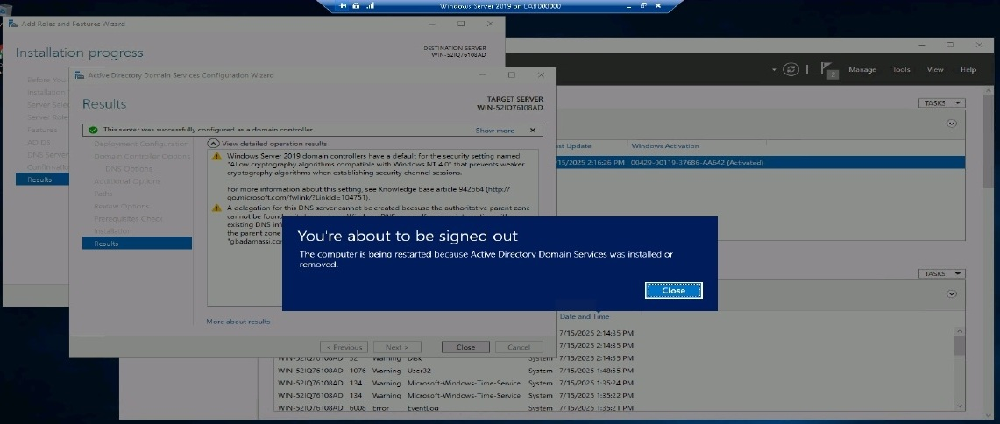
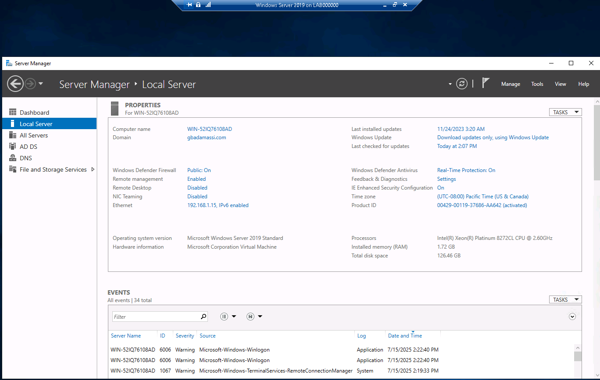
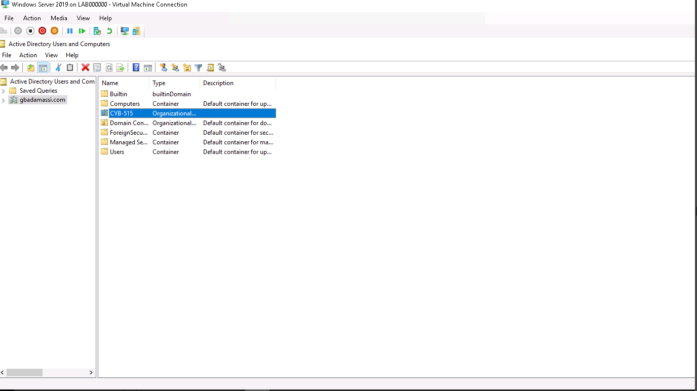
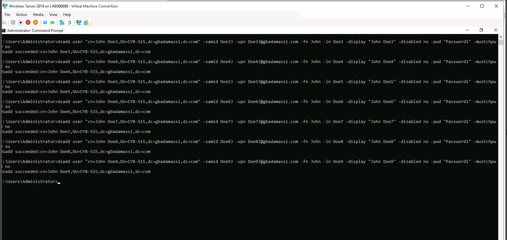
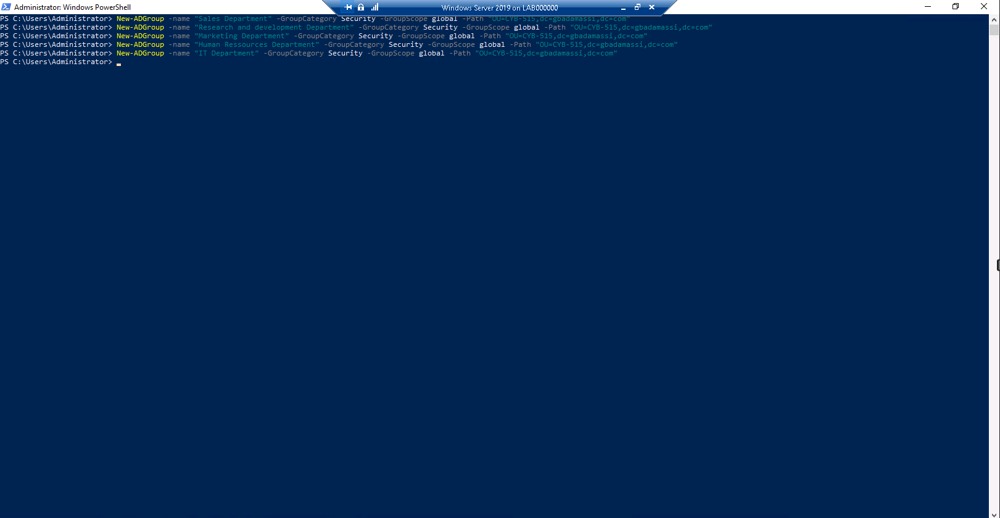
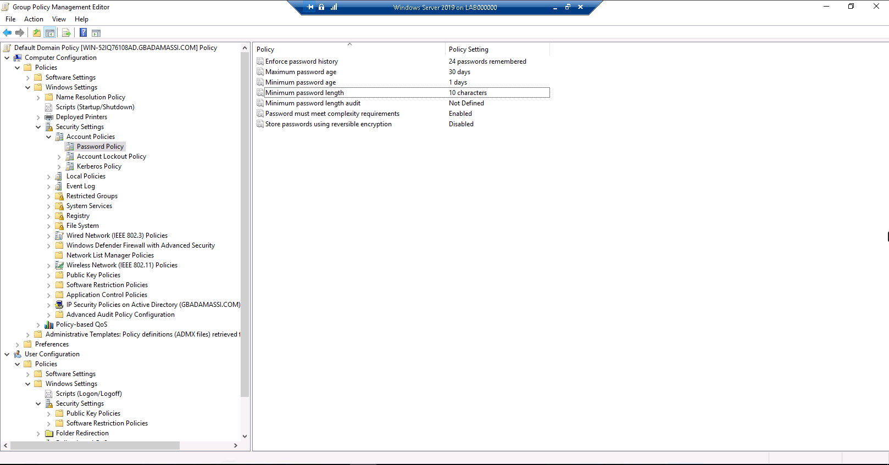
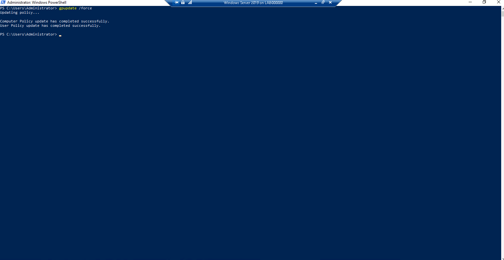

# Windows Server 2019 Active Directory Administration Lab

## 📌 Project Overview

This project demonstrates the deployment and administration of a Microsoft Active Directory environment using Windows Server 2019.

The lab focuses on identity and access management, user and group administration, organizational units, PowerShell administration, and Group Policy security configuration.

## 🛠️ Technologies Used

- Windows Server 2019
- Active Directory Domain Services (AD DS)
- Active Directory Users and Computers (ADUC)
- PowerShell
- Windows Command Prompt
- Group Policy Management
- Hyper-V

## 🎯 Lab Objectives

The objectives of this lab were to:

- Install Active Directory Domain Services
- Configure Windows Server as a domain controller
- Create and configure an Active Directory domain
- Create an Organizational Unit (OU)
- Provision multiple domain user accounts
- Create departmental security groups using PowerShell
- Configure password security policies
- Apply and verify Group Policy settings

---

## 1. Active Directory Domain Services Installation

I installed Active Directory Domain Services (AD DS) on Windows Server 2019 and promoted the server to a domain controller.

### AD DS Installation and Domain Controller Promotion

*Windows Server 2019 successfully configured as an Active Directory domain controller after installing Active Directory Domain Services (AD DS).*

---

## 2. Domain Configuration

After configuring the domain controller, I verified the server and Active Directory domain configuration through Server Manager.

### Domain Configuration Verification

*Verification of the Windows Server 2019 domain controller and Active Directory domain configuration.*

---

## 3. Organizational Unit Creation

I created an Organizational Unit named `CYB-515` to provide a structured location for managing users and security groups.

### Organizational Unit Configuration

*Organizational Unit (OU) created in Active Directory Users and Computers to organize and manage domain users and security groups.*

---

## 4. User Account Provisioning

Using the Windows command-line interface and `dsadd`, I created multiple Active Directory domain user accounts inside the CYB-515 OU.

I then verified that the accounts were successfully created through Active Directory Users and Computers.

### Domain User Account Provisioning

*Multiple domain user accounts created and verified within the CYB-515 Organizational Unit in Active Directory.*

---

## 5. Security Group Administration with PowerShell

I used PowerShell and the `New-ADGroup` command to create departmental security groups, including:

- Sales Department
- Research and Development Department
- Marketing Department
- Human Resources Department
- IT Department

I then verified the groups through Active Directory Users and Computers.

### Security Group Creation with PowerShell

*Departmental security groups created in Active Directory using the PowerShell `New-ADGroup` cmdlet.*

---

## 6. Password Security Policy

I configured Active Directory password policy settings through Group Policy Management.

The configuration included password history, password age requirements, minimum password length, complexity requirements, and protection against reversible password storage.

### Password Policy Configuration

*Active Directory password requirements configured through Group Policy Management, including password history, age, length, complexity, and reversible encryption settings.*

---

## 7. Group Policy Enforcement

After configuring the security policy, I used `gpupdate /force` to refresh Group Policy and verify successful policy application.

### Group Policy Application Verification

*Group Policy settings refreshed and applied using `gpupdate /force` to verify successful policy enforcement.*

---

## 🔐 Security Concepts Demonstrated

- Identity and Access Management (IAM)
- Active Directory administration
- Domain controller configuration
- Organizational Units
- User account provisioning
- Security group management
- PowerShell administration
- Group Policy
- Password security
- Access control

## 📚 Skills Developed

Through this lab, I gained hands-on experience deploying and administering an Active Directory environment, managing users and security groups, using command-line and PowerShell tools for administrative tasks, and implementing security policies through Group Policy.
